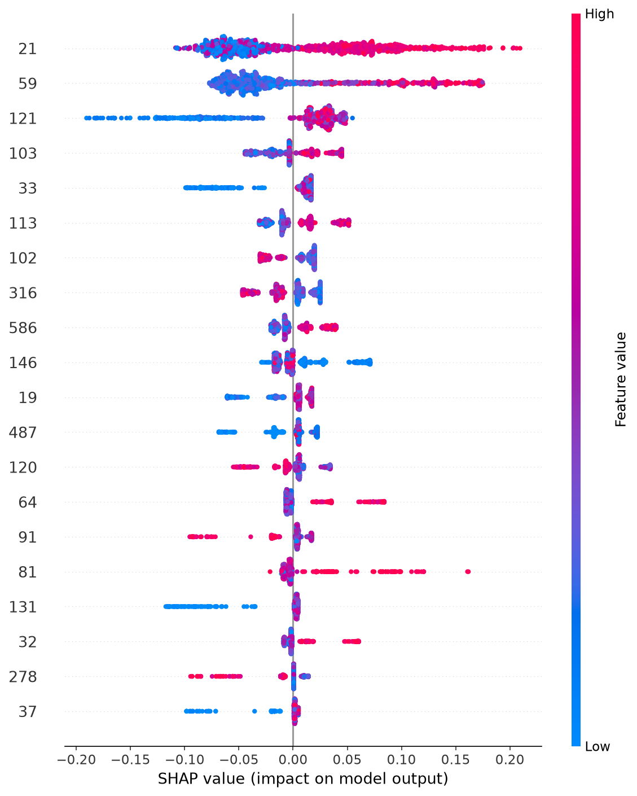

# SECOM Yield Detection

A defect detection pipeline for semiconductor manufacturing data (UCI
SECOM dataset): time-based data splitting, leakage-safe feature cleaning,
two candidate models (XGBoost and IsolationForest), SHAP-based
explainability, a FastAPI serving layer, and an optional local LLM agent
for natural-language queries over the API.

## Overview

- **Dataset**: 1567 production lots, 590 anonymized sensor readings each,
  ~6.6% defect (Fail) rate.
- **Models**: XGBoost (supervised) and IsolationForest (unsupervised),
  evaluated with time-series cross-validation — no random shuffling,
  since the data is time-ordered production output.
- **Explainability**: SHAP values for both per-instance and global
  feature importance.
- **Serving**: a FastAPI service exposing prediction and explanation
  endpoints, backed by a trained model artifact.
- **Agent**: an optional Ollama-based LLM agent that answers
  natural-language questions by calling the API as tools.

## Results

5-fold time-series cross-validation, evaluated against each fold's own
random baseline:

| Model | PR-AUC | ROC-AUC |
|---|---|---|
| XGBoost | 0.135 ± 0.051 | 0.535 ± 0.048 |
| IsolationForest | 0.102 ± 0.051 | 0.457 ± 0.082 |



## Modeling Approach

**Feature cleaning** (590 → 272 features), fit on the training set only:
1. Drop constant columns
2. Drop columns with >50% missing values
3. Drop highly correlated columns (|r| > 0.95, grouped via connected
   components); within each group, keep the column with the lower
   missing rate
4. Impute remaining missing values with the training-set median

**IsolationForest** (unsupervised): `contamination=0.07` is a fixed
domain-prior hyperparameter, not estimated from labels.

**XGBoost** (supervised): `binary:logistic` objective, `max_depth=3`,
`scale_pos_weight` computed per fold from that fold's training-set
class ratio, early stopping on the last 20% of the training fold
(minimum 50 rows) with `early_stopping_rounds=20` and
`eval_metric="aucpr"`. Training is single-threaded (`n_jobs=1`) —
multi-threaded histogram building was found to produce run-to-run
variance in the selected number of trees.

**Cross-validation**: `TimeSeriesSplit`, 5 folds — no random shuffling,
since production lots are time-ordered.

**Threshold selection**: chosen from the production model's own
held-out early-stopping tail (never the test set), maximizing recall
subject to precision ≥ 20% on the precision-recall curve.

**SHAP**: `TreeExplainer` with interventional feature perturbation and
probability-space output, so that `base_value + Σ shap_value` equals
the model's own `predict_proba` output. Background dataset is the
training set.

## Project Structure

```
secom-yield-detection/
├── requirements.txt        # Pinned dependency versions
├── data/raw/                # Raw dataset (not tracked in git)
├── models/                  # Trained model + metadata (not tracked in git)
├── notebooks/01_eda.ipynb   # Exploratory data analysis
├── reports/figures/         # Generated plots (e.g. SHAP summary)
├── scripts/demo.py          # Demo script for the API
├── src/
│   ├── data.py               # Data loading and time-based split
│   ├── features.py           # Leakage-safe cleaning transformer
│   ├── train.py               # Training, cross-validation, threshold selection
│   ├── explain.py             # SHAP explanations
│   ├── api.py                 # FastAPI service
│   └── agent.py               # LLM agent (Ollama + tool calling)
└── tests/                     # Unit and integration tests
```

## Getting Started

```bash
# Install dependencies (Python 3.12)
pip install -r requirements.txt

# Train the model — produces models/model.pkl and models/metadata.json
python src/train.py

# (Optional) Generate SHAP explanations and the summary plot
python src/explain.py

# Start the API server
uvicorn src.api:app --reload
# Interactive docs at http://127.0.0.1:8000/docs

# (Optional) Run the demo script against the running API
python scripts/demo.py

# (Optional) Chat with the LLM agent (requires Ollama with a tool-calling model)
python src/agent.py

# Run the test suite
pytest
```

## Requirements

- Python 3.12
- All direct dependencies are pinned in `requirements.txt`
- Ollama (only needed for `src/agent.py`)
